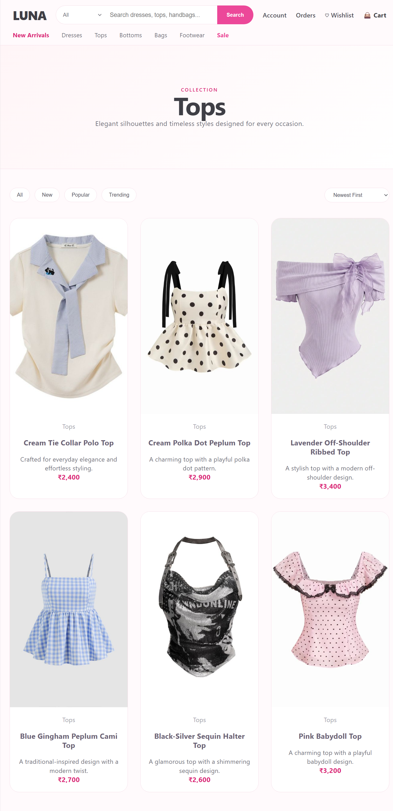
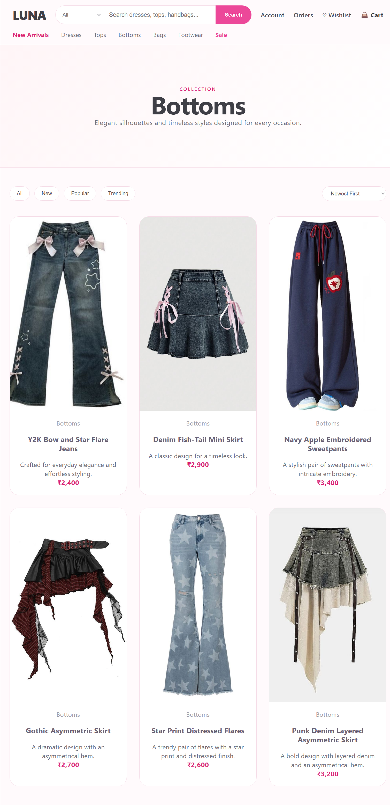
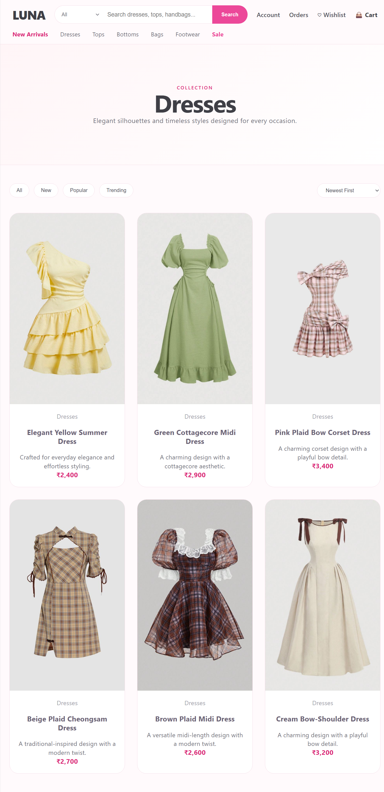
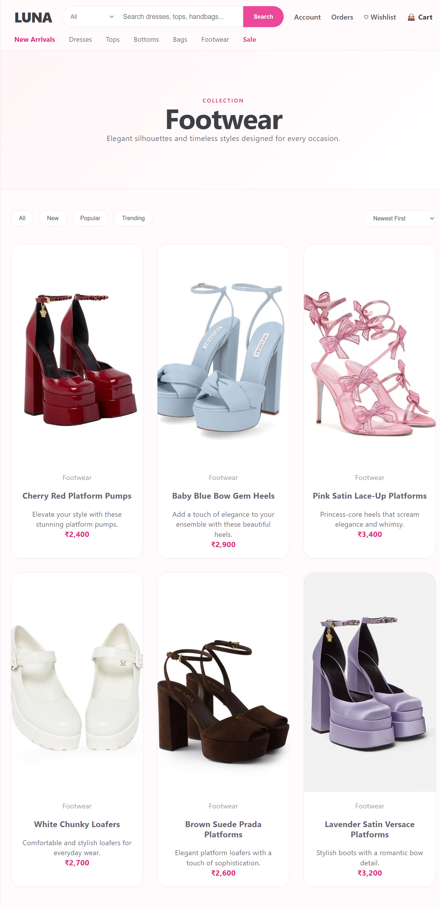
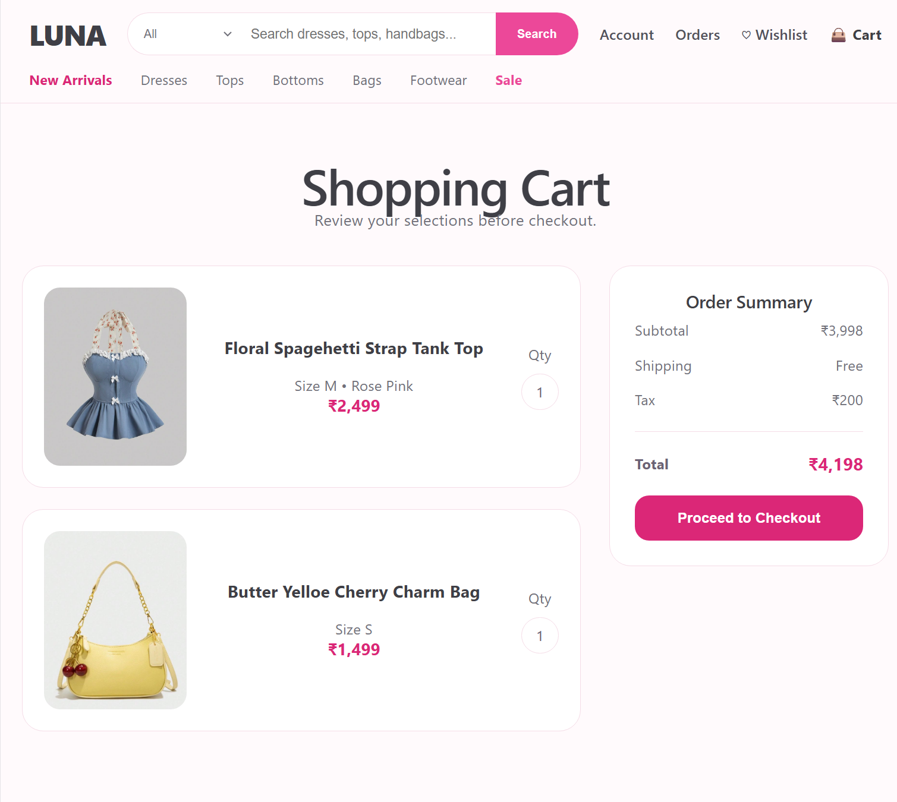
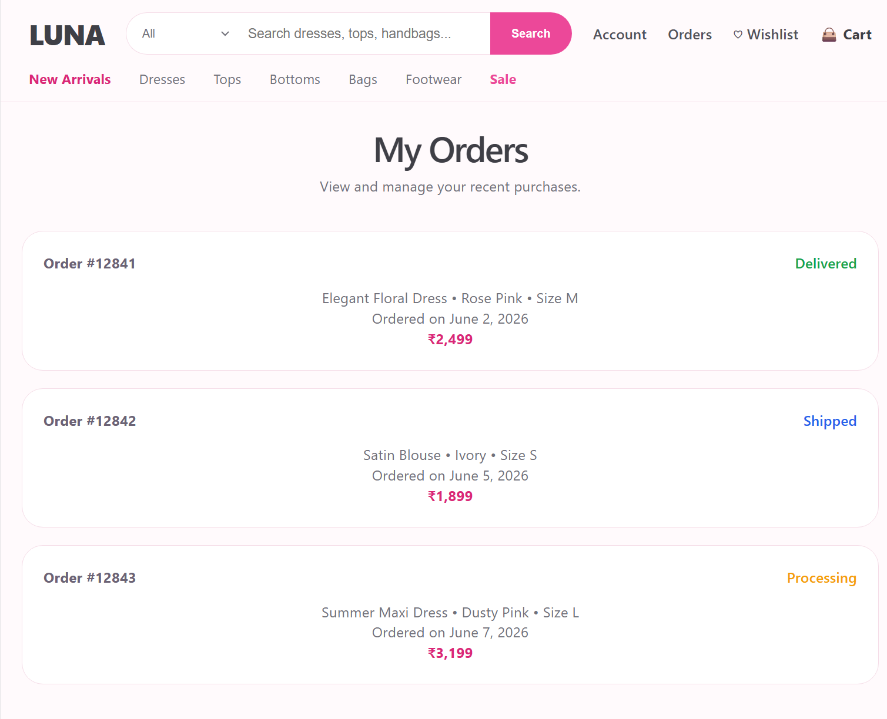
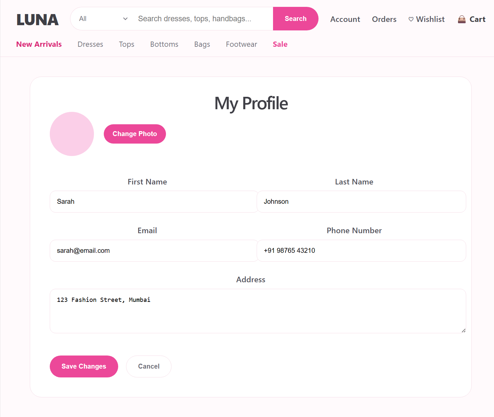
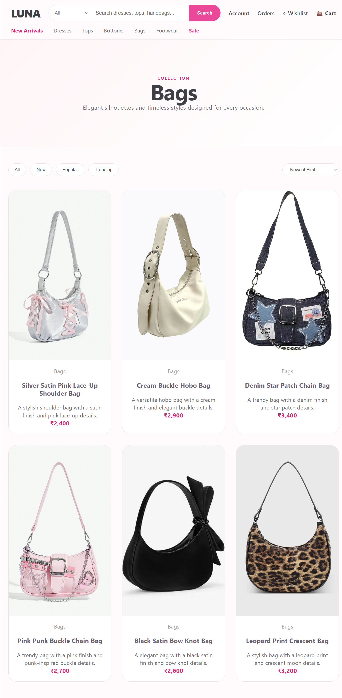

##E-Commerce Website

A modern and responsive E-Commerce Website built using React. The application provides an intuitive shopping experience with category-based browsing, wishlist management, shopping cart functionality, and order tracking.

##Features

- Home Page
- Tops Collection
- Bottoms Collection
- Dresses Collection
- Footwear Collection
- Sale Section
- Wishlist Management
- Shopping Cart
- Orders Management
- Responsive Design

##Tech Stack

- React.js
- JavaScript
- HTML
- CSS

## Screenshots

### Home Page

### Tops Collection

### Bottoms Collection

### Dresses Collection

### Footwear Collection

### Sale Section

### Wishlist

### Shopping Cart

### Orders Page

### Account Page

### Bags Collection
